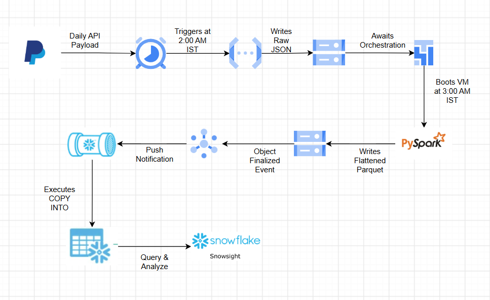

# PayPal End-to-End Data Pipeline

An automated data engineering pipeline that extracts PayPal API data, transforms it in the cloud, and loads it into a Snowflake data warehouse for analytics. 

## Pipeline Workflow

1. **Extraction (2:00 AM IST)**: A serverless Google Cloud Function extracts daily transaction payloads from the PayPal API and writes raw JSON data to a Google Cloud Storage (GCS) bucket.
2. **Orchestration & Transformation (3:00 AM IST)**: Apache Airflow orchestrates the workflow, booting up a Compute Engine VM where Apache Spark processes and flattens the raw JSON into optimized Parquet files.
3. **Event-Driven Ingestion**: The creation of new Parquet files triggers an object finalized event, sending a push notification via GCP Pub/Sub.
4. **Data Warehousing**: Snowpipe captures the notification and executes a `COPY INTO` command, automatically loading the Parquet files into a Snowflake target table for querying and analysis in Snowsight.

## Technology Stack

* **Cloud Provider**: Google Cloud Platform (GCP)
* **Compute & Processing**: Cloud Functions, Compute Engine, PySpark
* **Storage**: Google Cloud Storage (GCS)
* **Orchestration**: Apache Airflow
* **Data Warehouse**: Snowflake, Snowpipe
* **Messaging**: Pub/Sub

## Security Note
API credentials, virtual environment configurations, and raw data files are intentionally excluded from this repository via `.gitignore` to maintain security.
